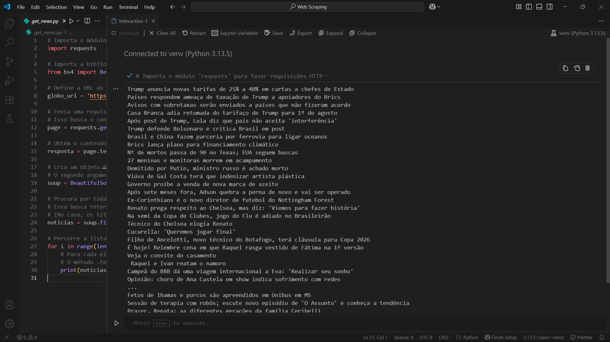
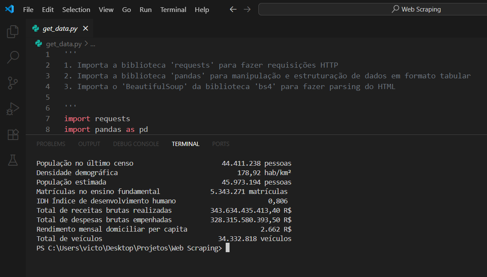
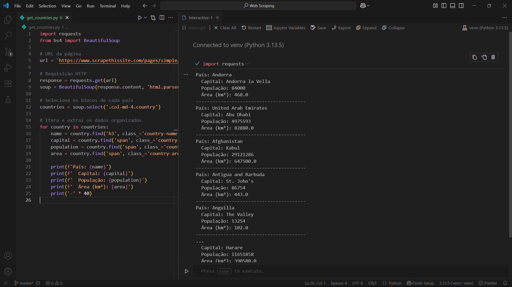

# Prática de Web Scraping com Python

Este repositório contém scripts desenvolvidos para fins de estudo e prática de **web scraping** utilizando as bibliotecas `requests`, `BeautifulSoup` e `pandas`.

## Arquivos

### 📄 `get_news.py`

Script para extração de manchetes de notícias da página principal do site **Globo.com**.

#### Funcionalidade:

- Realiza uma requisição HTTP à homepage da Globo.
- Analisa o HTML usando BeautifulSoup.
- Busca títulos de notícias baseando-se em tags e classes específicas.
- Exibe os títulos encontrados no terminal.

#### Observação:

A estrutura do site pode mudar, o que pode exigir ajuste nas seleções (`tag`, `class` etc.).

---

### 📄 `get_data.py`

Script que coleta indicadores socioeconômicos de uma **unidade federativa (UF)** diretamente do site do **IBGE**.

#### Funcionalidade:

- Acessa a página do IBGE de uma UF (`https://www.ibge.gov.br/cidades-e-estados/{uf}.html`).
- Extrai os indicadores (como população, PIB etc.).
- Limpa e organiza os dados.
- Retorna os dados em um `DataFrame` do `pandas`.

---

### 📄 `get_countries.py`

Script que coleta informações básicas sobre países a partir do site **scrapethissite.com**.

#### Funcionalidade:

- Acessa a página `https://www.scrapethissite.com/pages/simple/`.
- Extrai blocos de HTML contendo os dados de cada país.
- Para cada país, coleta:
  - Nome
  - Capital
  - População
  - Área (km²)
- Exibe essas informações de forma formatada no terminal.

---

## 📸 Demonstração

Abaixo, exemplos da saída dos scripts ao serem executados:

### `get_news.py`



---

### `get_data.py`



---

### `get_countries.py`



---

### 📌 Exemplo de uso — `get_data.py`

O script `get_data.py` contém a função `scraping_uf(uf: str)`, que realiza web scraping no site do IBGE para coletar indicadores socioeconômicos de uma Unidade Federativa (UF) brasileira. A função retorna um `DataFrame` com os dados estruturados.

#### Como utilizar:

```python
# get_data.py

from get_data import scraping_uf  # Certifique-se de estar no mesmo diretório ou ajustar o caminho

# Scraping dos indicadores do estado de São Paulo (UF = 'sp')
df_sp = scraping_uf('sp')

# Exibe o DataFrame com os indicadores obtidos
print(df_sp)
```

#### Exemplo de saída:

```
                         Valor
População estimada     44.420.459 pessoas
Densidade demográfica        166,23 hab/km²
IDH                          0,783
PIB per capita         R$ 49.912,68
...
```

✅ O parâmetro `uf` deve ser a sigla da unidade federativa no formato minúsculo (ex: `'rj'`, `'mg'`, `'sp'`).
